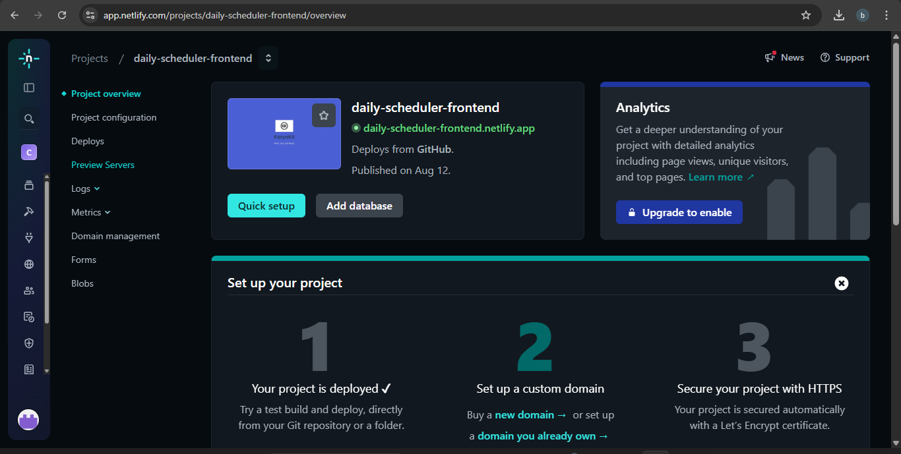
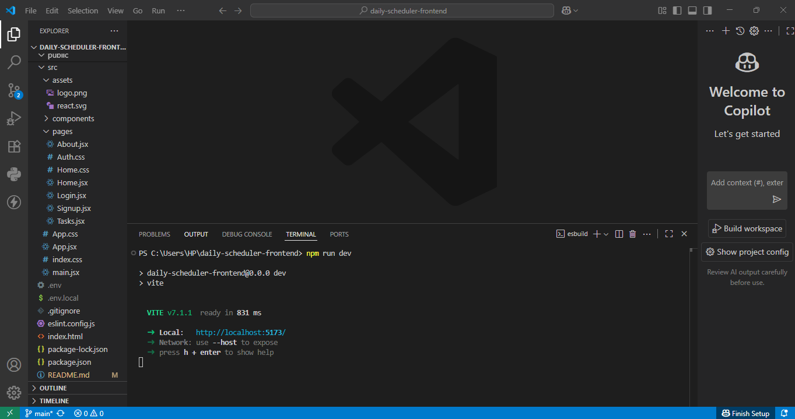
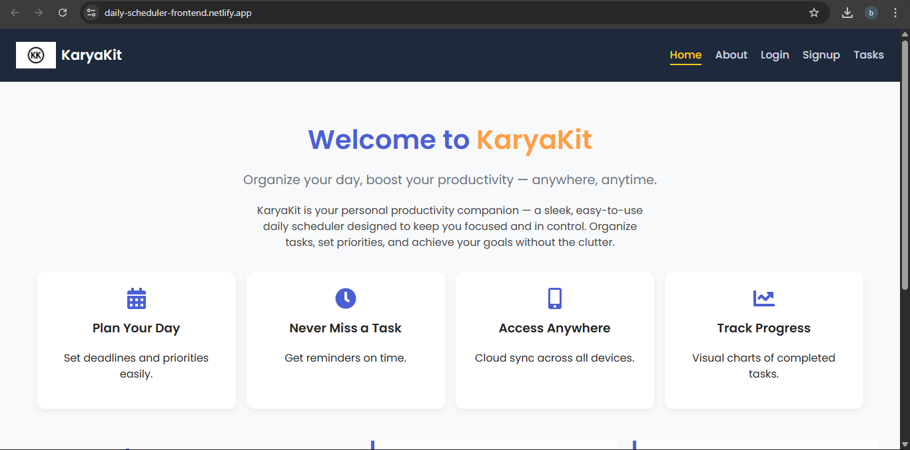

### KaryaKit  (Daily Scheduler — Frontend)

KaryaKit is a simple yet powerful cloud-based web application designed to help you organize your daily tasks in one place. The goal of this project is to make task management straightforward, accessible from any device, and visually clean. It allows you to create tasks, view them in real-time, and delete them when they are no longer needed — all while being connected to a live backend database.

This repository contains the frontend part of the application, built using React with Vite for fast development, and styled using CSS for a clean, responsive design. The backend is built separately and provides an API for storing and retrieving tasks from a cloud database.

##### Introduction

Keeping track of daily tasks can become overwhelming when juggling multiple responsibilities. Daily Scheduler aims to provide a minimal and intuitive interface to help you focus on what matters. The app is cloud-connected, so your tasks are always available as long as you have an internet connection. Whether you are using it on your laptop or mobile device, your data stays synchronized.

This project is also designed as a learning exercise for building and deploying a full-stack application with modern technologies. It demonstrates the complete process of setting up a frontend with React, connecting it to a backend API, and deploying both parts to separate hosting platforms.

Screen recording for your reference - 

##### Live Demo

Frontend: https://daily-scheduler-frontend.netlify.app/  

Backend API: https://daily-task-scheduler-backend.onrender.com

##### Features

\- Add new tasks with a simple form containing a title and description.

\- View the full list of tasks, updated instantly after changes.

\- Delete tasks you have completed or no longer need.

\- Store tasks in a cloud database so they are available anywhere.

\- Responsive and mobile-friendly layout.

##### 

##### Tech Stack

* Frontend: React (Vite), CSS, React Router DOM, react-icons  
* Backend: Node.js, Express, MongoDB Atlas (via Mongoose)  
* Hosting: Netlify (Frontend), Render (Backend)

##### Project Structure

frontend/

├── public/ # Static files

├── src/ # React components \& pages

│ ├── components/ # Reusable UI components

│ ├── pages/ # Page-level components

│ ├── App.jsx # Root component

│ └── main.jsx # Entry point

├── .env.local # Environment variables (ignored by Git)

├── package.json

└── vite.config.js

##### Installation \& Setup

* Clone the repository

git clone https://github.com/your-username/daily-scheduler-frontend.git

Navigate into the project directory

* Daily-scheduler-frontend

Install dependencies

npm install

* Create .env.local file

Add your backend API URL:

VITE\_API\_URL=https://daily-task-scheduler-backend.onrender.com

* Start the development server

npm run dev

Open http://localhost:5173 in your browser.

##### 

##### Usage

* Open the app in your browser.

* Signup if you do not have a account.

* if you already have an account then just login to get started 

* Use the input form to add a new task by entering a title and description.

* View your updated task list instantly as tasks are fetched from the backend.

* Edit or Delete tasks when they are completed or no longer relevant.

* Enjoy a smooth, responsive interface across devices.

##### Future Enhancements

* Option to set due dates and receive reminders.

* Ability to mark tasks as completed instead of deleting them.

* Search and filter features for large task lists.

* User authentication so each user has a private list of tasks.

* Improved UI animations for better user experience.

##### Contributing

Contributions to this project are welcome. You can help by fixing bugs, adding new features, or improving the design.

* Fork the repository on GitHub.
* Create a new branch for your changes:

git checkout -b feature/your-feature-name

* Make your changes and commit them:

git commit -m "Add some feature"

* Push your branch to your fork:

git push origin feature/your-feature-name

* Open a Pull Request on GitHub.

##### License

This project is licensed under the MIT License. You are free to use, modify, and distribute it under the terms of the license.

##### 

##### Screenshots and Screenrecordings 

### Screenshots
  
  
  

### Full Demo Video (High Quality)
[▶ Watch on YouTube](https://youtu.be/JMJ5UqlWFMU)

